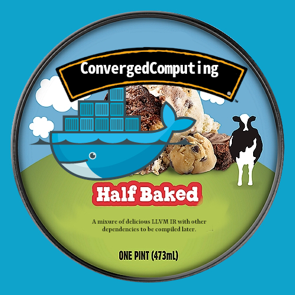

# Half Baked



This is an experiment to try building a base image with an [LLVM IR]() "internal representation" that can
be finalized (the compilation finished) more on demand to be fit to a node. This approach would be suitable for cases when we need a niche architecture, but don't have one built in advance. It provides an alterative to what we currently consider the only option.
More specifically:

- Option 1: pre-build all options / variants of an application (and maybe miss some or get it wrong)
- Option 2: start with a "half baked" image, and then finish compilation on demand for exactly what we need.

The second option also only requires one image base! Let's give a shot, with a simple LAMMPS build. Our strategy here will be the following:

1. Try first a manual approach, manual builds on a local system.
2. Try a design that is in Kubernetes
3. Optimize the design in Kubernetes

For the last, it's not clear if we will want an operator or similar, e.g., something with an init container or even a mutating webhook.
We will likely also need to consider caching or deploy strategies, because we wouldn't want to kick off 1000x of the same build at once!

## Build

### Manual Approach

Let's build the half baked image, manually first.

```bash
docker build -t half-baked .
```

This will generate the llvm-ir files in `/code`. We can next try running (and completing them) with a Batch job (to come next).
